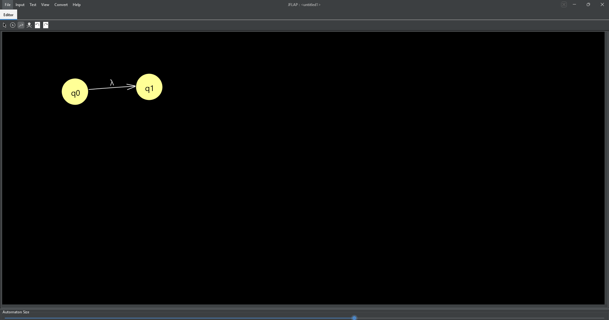
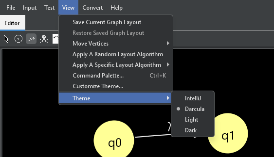
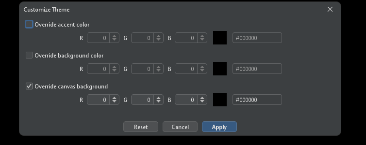
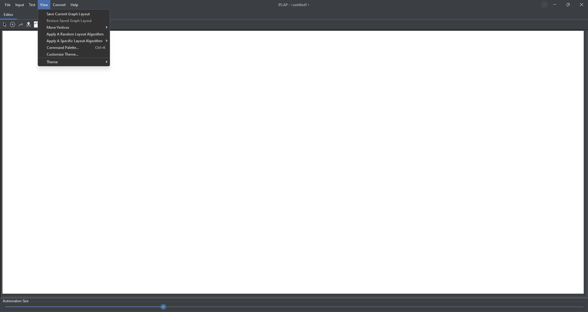
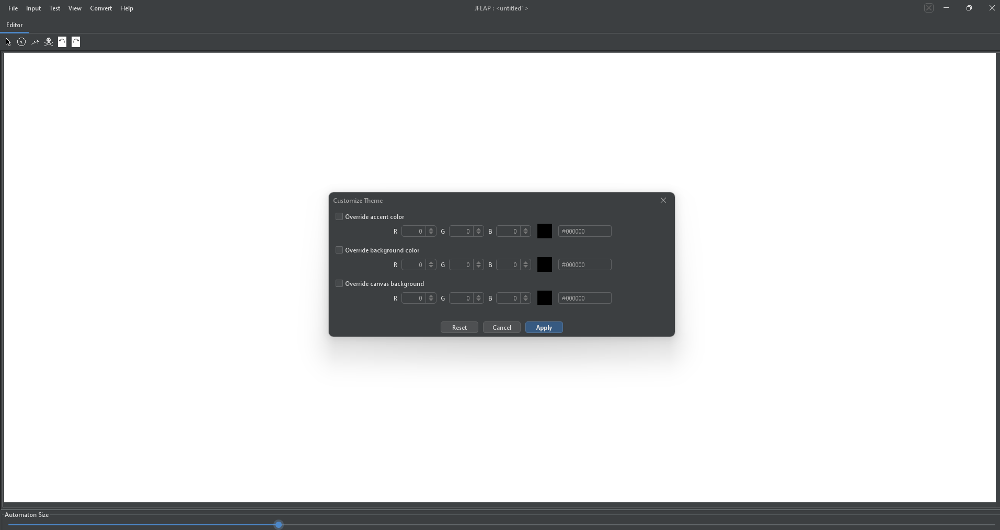
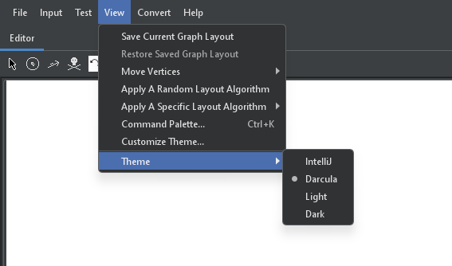

# JFLAP 7.1 Better UI (Unofficial)

This repo builds a more modern, themeable UI for the original **JFLAP 7.1** by wrapping it with a small launcher (Swing + FlatLaf) and applying a couple of tiny runtime/bytecode tweaks for readability.

The primary distributable in this folder is:

- `JFLAP7.1-better-ui.jar`

## Run

```bash
java -jar JFLAP7.1-better-ui.jar
```

Launcher options:

```bash
java -jar JFLAP7.1-better-ui.jar --help
```

- `--theme=light|dark|intellij|darcula`
- `--uiScale=<number>` (example: `--uiScale=1.25`)
- Short flags: `--light`, `--dark`, `--intellij`, `--darcula`
- Also supported: `-Djflap.theme=<theme>` or env var `JFLAP_THEME=<theme>`

## What Changed 

- Modern look & feel via **FlatLaf** (defaults to **Darcula**).
- `View > Theme` menu: IntelliJ / Darcula / Light / Dark (saved).
- `View > Customize Theme...`: RGB overrides for:
  - Accent color
  - App background
  - Canvas background (optional checkbox)
- `Ctrl+K`: Command Palette for quick actions.
- Canvas dark-mode fixes:
  - Transition arrows/labels stay visible on dark canvases.
  - Delete tool cursor is forced to a visible crosshair.
- Toolbar icons are recolored at runtime to match the current theme.

## Command Palette

Open it with `Ctrl+K` (or `Cmd+K` on macOS) or via `View > Command Palette...`.

- Type to search actions from the current window’s menu bar (shows the full path like `File > Open...`).
- Use ↑/↓ to select, `Enter` to run, `Esc` to close.

## Screenshots

Dark canvas :



Theme menu (dark):



Customize Theme dialog (dark):



Example dialog styling (dark):


View menu :



Customize Theme dialog:



Theme menu:



Video:

- `assets/demo vid 1.mp4`

## Build

Requirements:

- A JDK on PATH (`javac`, `jar`)
- Internet access on first run (downloads FlatLaf + ASM to `deps/`)

```powershell
powershell -File .\build-modern.ps1 -InputJar .\JFLAP7.1.jar -OutputJar .\JFLAP7.1-better-ui.jar
```

## License / Redistribution Notes (Not Legal Advice)

Per the **JFLAP 7.1** license, distributing modified copies requires (at minimum):

- Include the JFLAP license text.
- Do **not** charge a fee for any product that includes any part of JFLAP.
- Provide clear contact info for the modifications.
- If the maintainer asks, provide the modified source code without fee.

This build includes:

- JFLAP license text inside the jar as `LICENSE`
- `MODIFICATIONS.txt` (contact: `egasudjali2@gmail.com`)
- Source code for the modifications inside the jar under `launcher-src/` and `tools-src/`
- FlatLaf license inside the jar as `META-INF/LICENSE` (Apache License 2.0)
- Convenience copies of both licenses in `licenses/`

Disclaimer: This is not an official JFLAP release and is not endorsed by the original author/maintainer.
